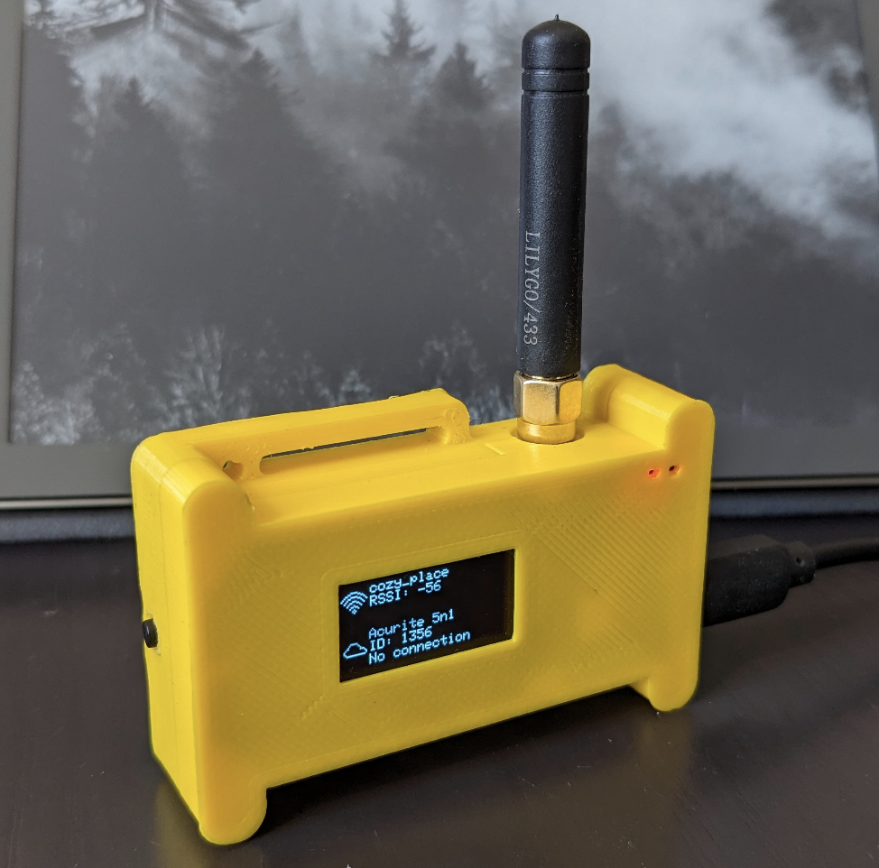
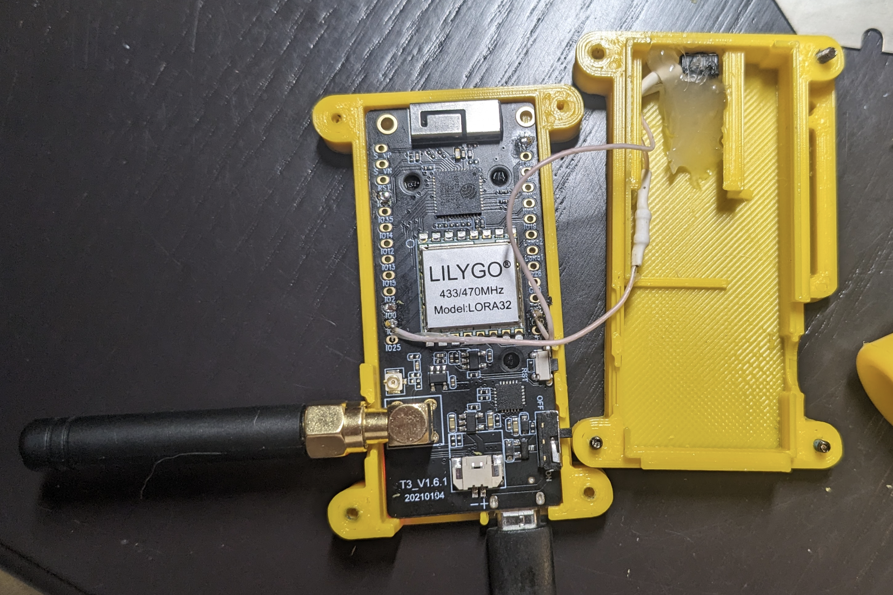
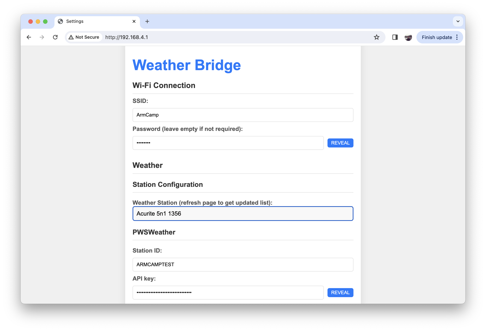

# Acurite 5n1 -> Weather Services Forwarder

Receives AcuRite 5n1 Weather Station measurements and uploads them to multiple weather services.
Try [Marine Screen](https://github.com/shchuko/marine-screen) to display your station measurements on TV

* [How to assemble](#assemble).
* [How to configure data export](#configuring-data-export).
* [Known problems](https://github.com/shchuko/acurite-bridge/issues).
* [Debugging](#debugging)

Supported weather services:

* [PWS Weather](https://www.pwsweather.com/)
* [Weather Underground](https://www.wunderground.com/)
* [Windy.com](https://stations.windy.com/)
* [Windguru](https://www.windguru.cz/)

Based on [TTGO / LILYGO LoRa32](https://www.lilygo.cc/products/lora3) (ESP32 + SX1278 433 Mhz transceiver).

## Working station examples

* [Armenian Camp](https://www.facebook.com/armeniancampp/), Artanish, Armenia
  * PWSWeather - https://www.pwsweather.com/station/pws/ARMENIANCAMP
  * Windy.com - https://www.windy.com/station/pws-f0d6df5a
  * WindGuru - https://www.windguru.cz/station/4155
  * WeatherUnderground - https://www.wunderground.com/dashboard/pws/IGEGHA5

## Assemble

1. Connect a button between GPIO4 and GND.
   
2. Connect ESP32 to PC.
3. Run  `Upload Filesystem Image` and `Upload` PlatformIO targets
4. Find ESP32 started and showing info.

## Configuring data export

1. Unplug power cable from device.
2. Press and hold a button (connect GPIO4 to GND).
3. Plug the power cable back holding the button. Device will start in **Configuration Mode**. Once it starts, release
   the button.
4. Find Wi-Fi AP info and IP address on the device screen (by default it's `WBridge-AP` non-protected Wi-Fi network and
   most likely [192.168.4.1](http://192.168.4.1/) IP).
5. Connect to the AP, open IP address in web browser.
   
6. Enter your Wi-Fi Network Name (SSID) and Password.
7. Select *Weather Station* from the list (the device will listen for station signals, to get updated list refresh the
   page). Currently supported AcuRite 5n1 only.
8. Fill weather service credentials. Empty credentials will disable respective exporter.
9. If you're not in UTC timezone, please specify your timezone in POSIX format, see
   the [documentation](https://www.gnu.org/software/libc/manual/html_node/TZ-Variable.html).
10. Click on the "SAVE SETTINGS" button.
11. Find your device rebooted and using the new settings.

## Many thanks to

* [Lopaka.app](https://lopaka.app/) which helped designing and developing display screens extremely easy and fast.
* [JesAde](https://www.thingiverse.com/jesade/designs)
  for [LoRa32 module case 3D model](https://www.thingiverse.com/thing:4518757).
* [NorthernMan54](https://github.com/NorthernMan54) for
  his [port of rtl_433 library](https://github.com/NorthernMan54/rtl_433_ESP) for ESP.
* [Flipper Zero](https://flipperzero.one/) developers for creating a handy tool with 433Mhz signals recording feature 
  (the device was developed without having physical access to the weather station, only signal records were used).

## Notes

* The code is written not really efficient, consumes many memory. But this wasn't a plan to have it efficient, I wanted
  to have it simply working in short time :)
* To reduce memory consumption, the code contains
  shrunk [port of rtl_433 library](https://github.com/NorthernMan54/rtl_433_ESP) copied directly to [lib/](lib).
* It's pretty easy to support other stations (not AcuRite 5n1 only), but there was not really reasonable to have this in
  current use case.
* Precipitation measurements from AcuRite 5n1 are received in weird time window, to be investigated whether they're
  interpreted correctly. Rain precipitation exporting to weather services are temporary disable to avoid sending garbage.

## Debugging

For debugging purpose, raw weather station data and important log messages can be sent
to [Loki](https://grafana.com/oss/loki/). To enable Loki logging,
copy [config/secrets.ini.dist](config/secrets.ini.dist) into `config/secrets.ini` and configure Loki exporter there. Then you'll be able to read station logs remotely in Loki, without connecting ESP to PC.

Check internals at [LokiLogger](include/weatherBridge/LokiLogger.hpp).
